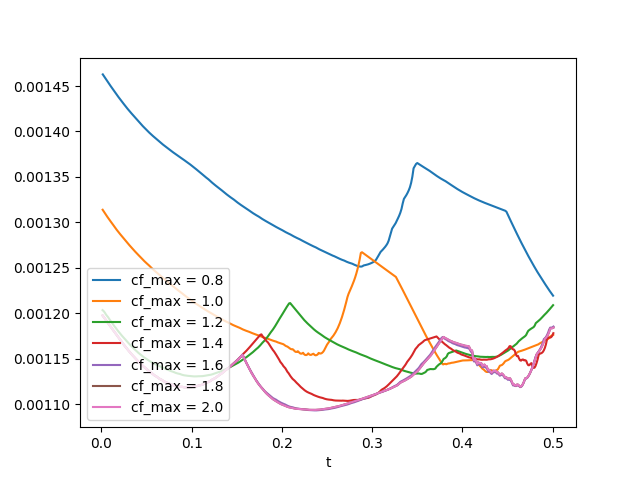
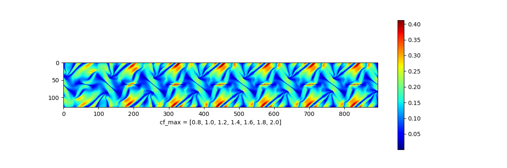
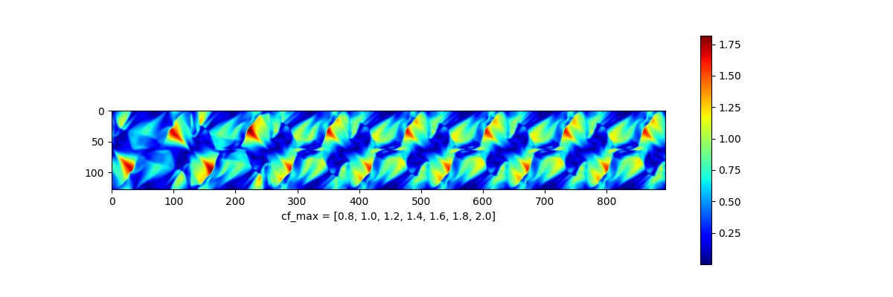
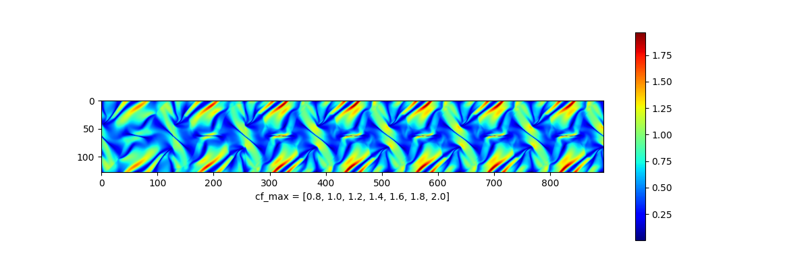
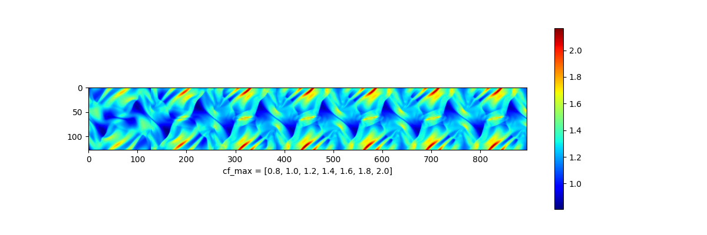

# mhd-boris
2.5D Constrained Transport Magnetohydrodynamics

Philip Mocz (2024), [@PMocz](https://twitter.com/PMocz)

Based on 
[algorithm write-up on Medium](https://levelup.gitconnected.com/create-your-own-constrained-transport-magnetohydrodynamics-simulation-with-python-276f787f537d)

See also: https://arxiv.org/abs/1902.02810

Simulate the Orszag-Tang vortex MHD problem
with the Boris-like Integrator

Run the simulations (`python mhd-boris.py <prob_id> <cf_max>`) and produce analysis with:

```bash
python mhd-boris.py 1 2.0
python mhd-boris.py 1 1.8
python mhd-boris.py 1 1.6
python mhd-boris.py 1 1.4
python mhd-boris.py 1 1.2
python mhd-boris.py 1 1.0
python mhd-boris.py 1 0.8
python analysis.py
```


## 1. Orszag-Tang

Timesteps:




Density:


Magnetic Pressure:



Velocity:



Alfven Speed: 



Fast Speed:




## 2. Alfven Wave

## 3. Advect Field Loop

